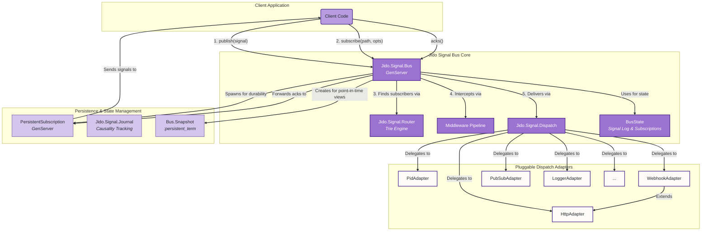
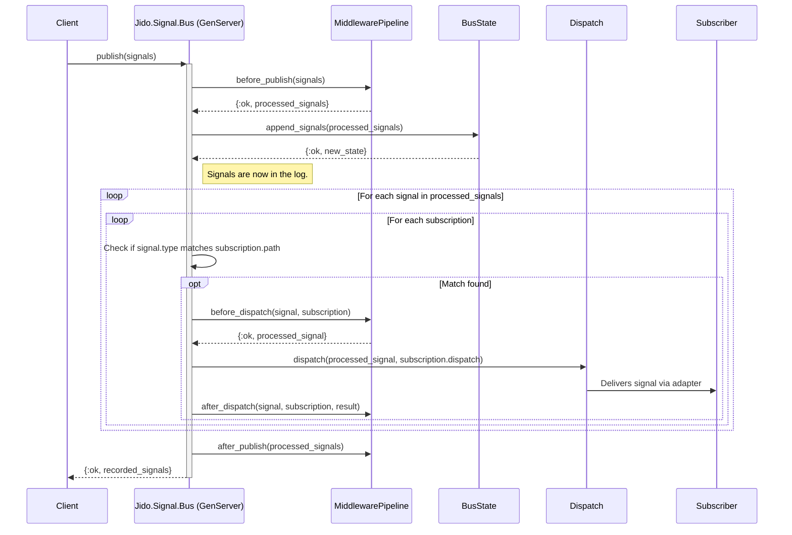
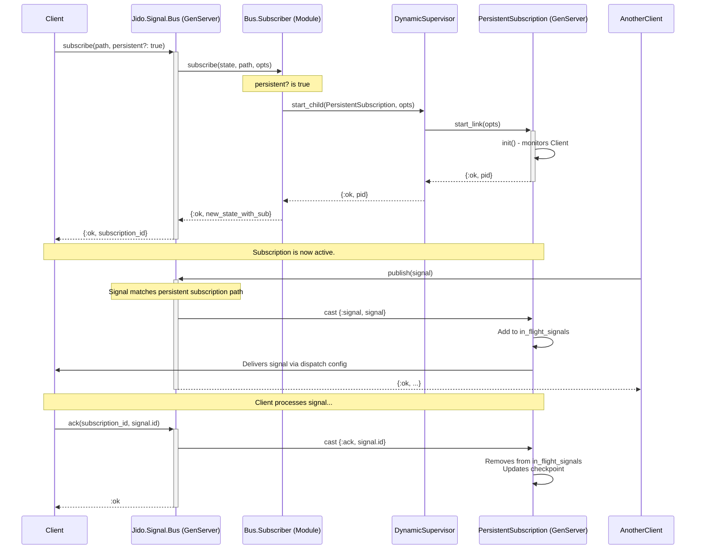
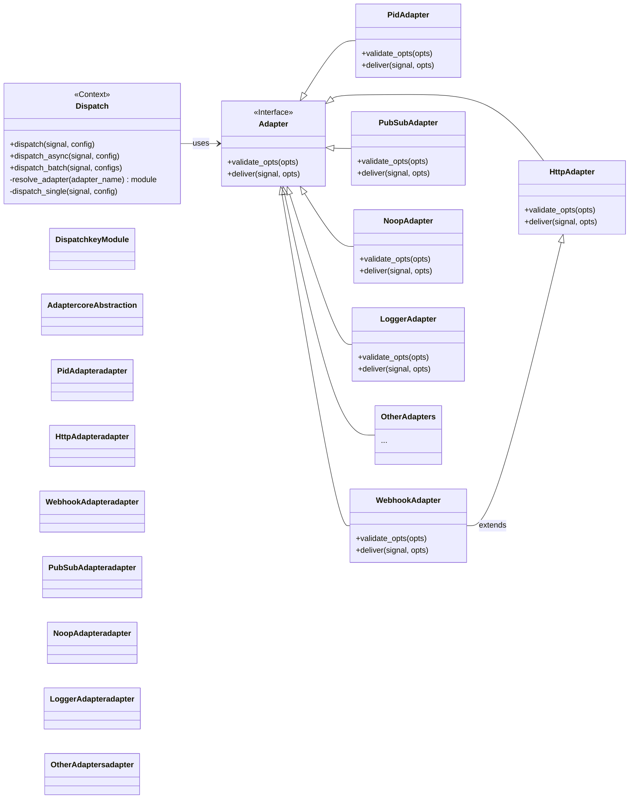
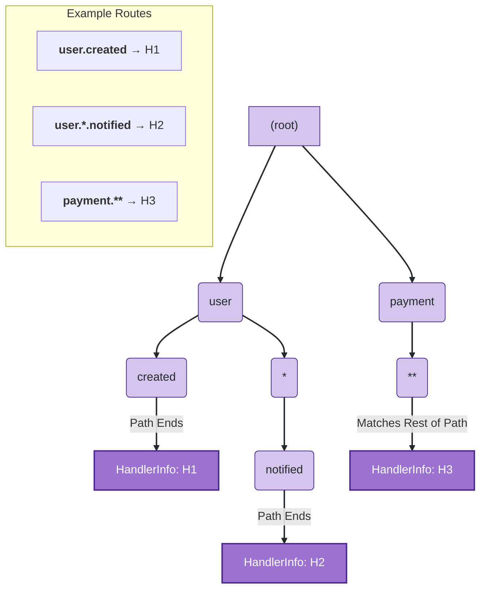
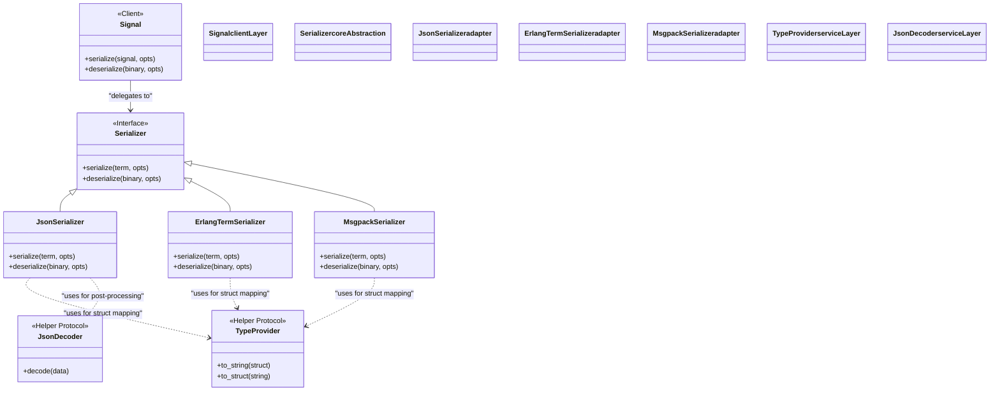
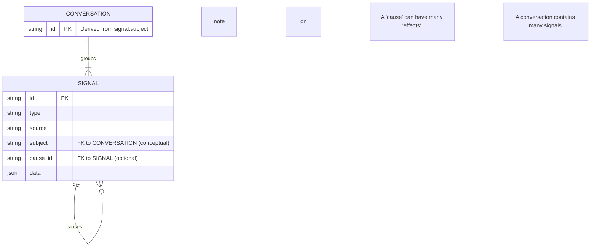
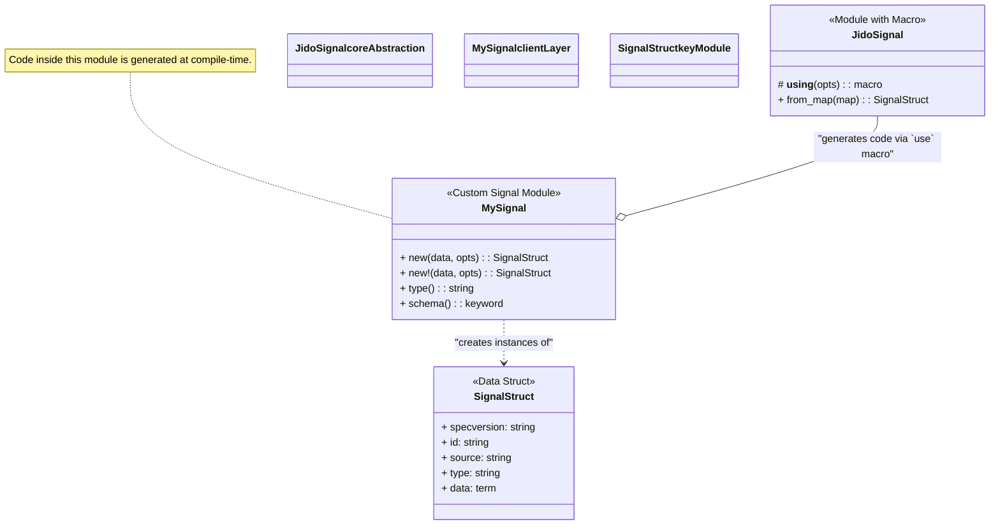

Of course. Based on the provided codebase, here are several detailed architectural diagrams rendered using Mermaid's text-based format. These diagrams illustrate the key components, their interactions, and the primary data flows within the `jido_signal` library.

### 1. High-Level Component Architecture

This diagram provides a C4-style component view of the Jido Signal system. It shows the main logical blocks, their responsibilities, and how they interact. It's a high-level overview of the entire library.

**Key Observations from the Code:**

*   **`Jido.Signal.Bus`** is the central `GenServer` that orchestrates most operations.
*   The `Bus` uses **`Jido.Signal.Router`** for matching signals to subscribers and **`Jido.Signal.Dispatch`** to send them.
*   The `Bus` manages its `BusState`, which contains the signal log and subscription data.
*   A `MiddlewarePipeline` intercepts signals at various stages (`before_publish`, `before_dispatch`, etc.).
*   For durable subscriptions, the `Bus` spawns and manages **`PersistentSubscription`** `GenServer`s.
*   The **`Dispatch`** module uses a pluggable adapter system to deliver signals to various targets like PIDs, HTTP endpoints, and PubSub systems.
*   **`Bus.Snapshot`** and **`Jido.Signal.Journal`** provide state and causality persistence.

---

### 2. Signal Publishing Flow

This sequence diagram details the journey of a signal from the moment it's published to the bus until it's dispatched to a subscriber. It highlights the role of middleware in the processing pipeline.

**Key Observations from the Code:**

*   The `Bus.publish/2` function is a `GenServer.call`.
*   The `MiddlewarePipeline.before_publish` hook runs first, allowing signal modification or halting the publish action.
*   Signals are recorded in the `BusState`'s log.
*   The bus iterates through subscriptions, using `Router.matches?` to find relevant subscribers.
*   For each match, `MiddlewarePipeline.before_dispatch` runs, followed by `Dispatch.dispatch`.
*   Finally, the `after_dispatch` and `after_publish` hooks run for side-effects like logging.

---

### 3. Persistent Subscription Flow

This diagram illustrates the process of creating and using a persistent subscription. It shows how the `Bus` coordinates with a `DynamicSupervisor` to spawn a dedicated `PersistentSubscription` process to manage state for a durable client.

**Key Observations from the Code:**

*   `Bus.subscribe` delegates to the `Jido.Signal.Bus.Subscriber` module.
*   If `persistent?` is true, a child process is started under the `Bus`'s `DynamicSupervisor`.
*   The child process is a `Jido.Signal.Bus.PersistentSubscription` GenServer, which manages its own state (checkpoint, in-flight signals).
*   When signals are published, the `Bus` dispatches them to the `PersistentSubscription` process, not directly to the client.
*   The `PersistentSubscription` process then forwards the signal to the client PID and waits for an `ack`.
*   `ack`s update the subscription's checkpoint, allowing it to resume from the correct position after a disconnect.

---

### 4. Dispatch Subsystem Architecture

This class diagram illustrates the design of the `Dispatch` module, which follows the **Strategy Pattern**. It defines a common `Adapter` behaviour (interface) and provides multiple concrete implementations (strategies) for different delivery mechanisms.

**Key Observations from the Code:**

*   `Jido.Signal.Dispatch.Adapter` defines the behaviour with `validate_opts/1` and `deliver/2` callbacks.
*   Modules like `PidAdapter`, `HttpAdapter`, and `PubSubAdapter` are concrete implementations of this behaviour.
*   `WebhookAdapter` is a specialized version of `HttpAdapter`, reusing its core logic and adding signature generation.
*   The `Jido.Signal.Dispatch` module acts as the "Context" in the pattern. It receives a configuration (e.g., `{:http, [...]}`), resolves the correct adapter module, and delegates the delivery task to it.

---

### 5. Router Engine Trie Structure

This diagram provides a conceptual view of the internal trie (prefix tree) data structure used by the `Router` to efficiently match signal types to handlers. It illustrates how different path patterns, including wildcards, are represented as nodes in the tree.

**Key Observations from the Code:**

*   `Jido.Signal.Router.Engine` builds and traverses this structure.
*   Each segment of a path (e.g., "user", "created") becomes a node in the trie.
*   Wildcards (`*` and `**`) are treated as special segment nodes.
*   `HandlerInfo` and `PatternMatch` structs are attached to nodes, representing the final target(s) for a matched path.
*   Routing involves traversing the trie segment by segment. When a wildcard node is encountered, the engine explores multiple matching paths. This structure allows for very fast lookups, as the time complexity is proportional to the length of the signal type's path, not the total number of routes.

---

### 6. Serialization Subsystem Architecture

This class diagram shows the architecture of the serialization system. It follows the **Strategy Pattern**, where a common `Serializer` behaviour defines the interface, and concrete modules (`JsonSerializer`, `ErlangTermSerializer`, etc.) provide specific implementations. This allows the system to be flexible and support multiple data formats.

**Key Observations from the Code:**

*   `Jido.Signal.Serialization.Serializer` defines the `serialize/2` and `deserialize/2` callbacks.
*   The `Jido.Signal.serialize/2` and `deserialize/2` functions act as the "Context", selecting the appropriate serializer at runtime based on configuration or options.
*   Helper protocols like `TypeProvider` (for mapping structs to string types) and `JsonDecoder` (for custom post-deserialization logic) are used by the serializers to handle Elixir-specific data structures correctly.

---

### 7. Journal Causality Data Model

This Entity-Relationship Diagram (ERD) illustrates the data model managed by the `Jido.Signal.Journal`. The journal's primary purpose is to track the causal relationships between signals, forming a directed acyclic graph of events.

**Key Observations from the Code:**

*   The core entity is the **Signal**.
*   The relationship `causes/is caused by` is a **recursive one-to-many relationship** on the Signal entity. A single signal (`cause`) can trigger multiple subsequent signals (`effects`). Each `effect` has at most one direct `cause`. This is implemented in the code via `put_cause`, `get_effects`, and `get_cause`.
*   A **Conversation** groups related signals. A signal's `subject` attribute conceptually links it to a conversation. The `put_conversation` and `get_conversation` functions manage this grouping.
*   The persistence adapters (`ETS`, `InMemory`) implement storage for this model.

---

### 8. Custom Signal Definition via Metaprogramming

This diagram explains the metaprogramming pattern used to define custom signal types. The `use Jido.Signal` macro acts as a code generator, injecting factory functions and configuration into a custom module, which then produces standardized `Jido.Signal` structs.

**Key Observations from the Code:**

*   The `Jido.Signal` module contains a `__using__` macro.
*   When a developer writes `use Jido.Signal, ...` in their own module (e.g., `MySignal`), this macro is invoked at compile time.
*   The macro defines functions like `new/2`, `new!/2`, `type/0`, and `schema/0` directly inside the `MySignal` module.
*   The options passed to `use` (like `:type` and `:schema`) are used to configure the generated functions.
*   The generated `new/2` function in `MySignal` validates its input against the provided schema and then calls `Jido.Signal.from_map` to create a standard `%Jido.Signal{}` struct, pre-filled with the configured defaults.

