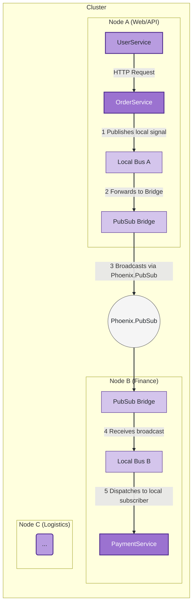

Excellent question. This gets to the heart of how a well-designed framework can be extended from a single-node context to a multi-node, distributed environment.

Let's conceptualize a use case and analyze how `jido_signal` is suited for the task.

### 1. The Conceptual Use Case: Distributed E-commerce System

Imagine an e-commerce platform that needs to scale horizontally. Different business domains are handled by services that might run on different nodes in a cluster to isolate workloads and improve resilience.

*   **Node A (Web/API Cluster):** Runs the `OrderService`. It receives customer orders via an API, validates them, and emits an `order.created` signal.
*   **Node B (Finance Cluster):** Runs the `PaymentService`. It is responsible for all financial transactions. It needs to listen for `order.created` signals to process payments. Upon success, it emits a `payment.processed` signal.
*   **Node C (Logistics Cluster):** Runs the `ShippingService`. It handles inventory and fulfillment. It needs to listen for `payment.processed` signals to start the shipping process.

The critical requirement is **location transparency**: the `OrderService` on Node A should not need to know that the `PaymentService` is on Node B. It simply publishes a signal, and the system ensures it gets to the right subscribers, regardless of their location in the cluster.



---

### 2. Framework Analysis: Suitability for the Task

The `jido_signal` framework, **as-is, is not a distributed bus out of the box**. A `Jido.Signal.Bus` GenServer is a process that is local to the Erlang node it is started on.

However, the framework is **perfectly suited for this task via integration**, without needing to be modified. Its pluggable adapter architecture is the key to this extensibility. It doesn't need to be *modified* or *wrapped*; it needs to be *integrated* with a distributed messaging backend.

Here's the breakdown:

| Question                        | Answer & Justification                                                                                                                                                                                                                                                                                                                                |
| ------------------------------- | ----------------------------------------------------------------------------------------------------------------------------------------------------------------------------------------------------------------------------------------------------------------------------------------------------------------------------------------------------- |
| **Is it suited as-is?**         | **No.** A bus started on Node A is not directly accessible by a process on Node B using its registered name (e.g., `:main_bus`). A signal published to the bus on Node A will only be delivered to subscribers running on Node A.                                                                                                                         |
| **Does it need to be modified?**  | **No.** The core logic of the `Bus`, `Router`, and `Dispatch` modules is sound. The architecture wisely separates signal routing logic from signal transport. The `Dispatch` module's adapter system is precisely the hook needed for distributed communication. Modifying the core would be the wrong approach.                                |
| **Does it need to be wrapped?**   | **No, not in the traditional sense.** You don't need to create a new API that hides `Jido.Signal.Bus`. Instead, you compose the existing pieces with a distributed messaging tool. The services themselves will still interact with the standard `Jido.Signal.Bus` API.                                                                                      |
| **Does it need to be integrated?** | **Yes. This is the correct approach.** The framework is designed to be integrated with an external, cluster-aware messaging layer. `Phoenix.PubSub` is the most idiomatic choice, and the framework already provides a `PubSubAdapter` for this exact purpose.                                                                                       |

---

### 3. Architectural Approach: The "Distributed Bridge" Pattern

The solution is to run a local `Jido.Signal.Bus` instance on each node and "bridge" them using a distributed PubSub system. This gives you the best of both worlds: the rich features of the local bus (middleware, logging, replay) combined with the scalability of a distributed backbone.

Here's how it works step-by-step:

1.  **Local Bus on Each Node:** Each node in the cluster starts its own instance of `Jido.Signal.Bus`. For example, `:node_a_bus` on Node A, `:node_b_bus` on Node B, etc.
2.  **Distributed PubSub Backbone:** The entire cluster shares a single `Phoenix.PubSub` instance, configured to work across nodes (e.g., using the `:pg` adapter).
3.  **The Bridge Component:** On each node, you run a special "Bridge" process. This is a simple `GenServer` that you would write. Its job is twofold:
    *   It subscribes to **all** signals on its **local bus** (`Jido.Signal.Bus.subscribe(local_bus, "**")`).
    *   It subscribes to a topic on the **distributed `Phoenix.PubSub`**.
4.  **The Flow:**
    *   The `OrderService` on Node A publishes its `order.created` signal to its local bus, `:node_a_bus`.
    *   The local bus on Node A dispatches this signal to all its local subscribers, including the Bridge process on Node A.
    *   The Bridge on Node A receives the signal and immediately broadcasts it to the distributed `Phoenix.PubSub` topic (e.g., `"signals:all"`).
    *   The Bridge processes on *all other nodes* (including Node B) receive this broadcast from `Phoenix.PubSub`.
    *   The Bridge on Node B takes the received signal and publishes it to *its* local bus, `:node_b_bus`.
    *   The local bus on Node B runs its own routing. It finds that the `PaymentService` is subscribed to `"order.created"` and dispatches the signal locally to it.

---

### 4. Code-Level Integration Points

This conceptual pattern translates directly into code.

**1. Set up Phoenix.PubSub (in `application.ex` on all nodes):**
```elixir
def start(_type, _args) do
  children = [
    # ... other children ...
    {Phoenix.PubSub, name: MyApp.PubSub, adapter: Phoenix.PubSub.PG2}
  ]
  # ...
end
```

**2. The Bridge `GenServer` (new component you would write):**
```elixir
defmodule MyApp.SignalBridge do
  use GenServer

  def start_link(opts) do
    GenServer.start_link(__MODULE__, opts, name: __MODULE__)
  end

  @impl true
  def init(opts) do
    @local_bus Keyword.fetch!(opts, :local_bus)
    @pubsub_server Keyword.fetch!(opts, :pubsub_server)
    @topic "signals:all"

    # Subscribe to the distributed PubSub system
    Phoenix.PubSub.subscribe(@pubsub_server, @topic)

    # Subscribe to ALL signals on the LOCAL bus
    Jido.Signal.Bus.subscribe(@local_bus, "**")

    {:ok, %{local_bus: @local_bus, pubsub_server: @pubsub_server, topic: @topic}}
  end

  # --- Handlers ---

  # Received a signal from the LOCAL bus, broadcast it to the cluster.
  # Use a guard to prevent re-broadcasting a signal we just received from the cluster.
  def handle_info({:signal, %Jido.Signal{} = signal}, %{from_cluster?: true} = state) do
    # This signal came from the cluster, don't broadcast it again.
    # Reset the flag for the next signal.
    {:noreply, %{state | from_cluster?: false}}
  end

  def handle_info({:signal, %Jido.Signal{} = signal}, state) do
    # This signal is local. Broadcast it to the world.
    Phoenix.PubSub.broadcast(state.pubsub_server, state.topic, signal)
    {:noreply, state}
  end

  # Received a signal from the CLUSTER, publish it to the local bus.
  def handle_info(%Jido.Signal{} = signal, state) do
    # Publish the signal to our local bus.
    # Set a temporary flag in our state to prevent an immediate re-broadcast loop.
    Jido.Signal.Bus.publish(state.local_bus, [signal])
    {:noreply, %{state | from_cluster?: true}}
  end
end
```

**3. Application Supervision Tree (on each node):**
```elixir
def start(_type, _args) do
  children = [
    # Start the local bus for this node
    {Jido.Signal.Bus, name: :my_local_bus},

    # Start the bridge to connect to the cluster
    {MyApp.SignalBridge, local_bus: :my_local_bus, pubsub_server: MyApp.PubSub},

    # Start the local services
    {MyApp.OrderService, bus: :my_local_bus}, # On Node A
    {MyApp.PaymentService, bus: :my_local_bus}, # On Node B
  ]
  # ...
end
```

### 5. Verdict

The `jido_signal` framework is **exceptionally well-suited** for distributed clusters, not because it *is* a distributed system, but because its design *enables* integration with one.

*   **Composability:** Its components (Bus, Dispatcher) are composable. The "Bridge" pattern is a clean composition of a local bus and a distributed PubSub system.
*   **Encapsulation:** The complexity of distribution is encapsulated entirely within the Bridge component. The business logic services (`OrderService`, `PaymentService`) remain simple and only need to know about their local bus. This is a huge win for maintainability.
*   **Flexibility:** If you wanted to switch from `Phoenix.PubSub` to RabbitMQ or Kafka, you would only need to change the Bridge's implementation, not any of your business services. You could even use a different `jido_signal` dispatch adapter inside the bridge.

In conclusion, the framework doesn't provide a "magic" distributed bus, but instead provides the necessary hooks and promotes a pattern that is more robust, flexible, and easier to reason about in a complex distributed environment.
