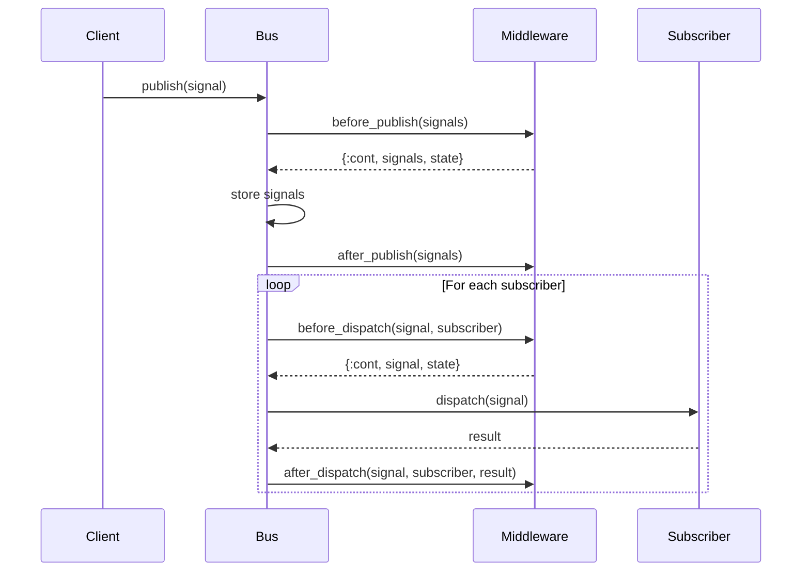

# Guide: Bus Middleware

Bus Middleware provides powerful hooks into the signal publishing and dispatch lifecycle, allowing you to transform signals, add observability, implement security policies, and control signal flow throughout your system.

## Middleware Concept and Lifecycle

Middleware modules implement callbacks that are executed at specific points in the signal bus lifecycle:

1. **Before Publish** - Called before signals are published to the bus
2. **After Publish** - Called after signals are successfully published
3. **Before Dispatch** - Called before each signal is dispatched to individual subscribers
4. **After Dispatch** - Called after each signal is dispatched to a subscriber



## Built-in Middleware.Logger

The `Jido.Signal.Bus.Middleware.Logger` provides comprehensive observability for signal flows:

### Basic Usage

```elixir
# Start bus with logging middleware
{Jido.Signal.Bus, [
  name: :my_bus,
  middleware: [{Jido.Signal.Bus.Middleware.Logger, []}]
]}
```

### Configuration Options

```elixir
middleware = [
  {Jido.Signal.Bus.Middleware.Logger, [
    level: :debug,                    # Log level (:debug, :info, :warn, :error)
    log_publish: true,               # Log publish events
    log_dispatch: true,              # Log dispatch events  
    log_errors: true,                # Log error events
    include_signal_data: true,       # Include signal data in logs
    max_data_length: 200             # Maximum data length to log
  ]}
]
```

### Sample Log Output

```
[info] Bus my_bus: Publishing 2 signal(s) of types: ["user.created", "user.updated"] [2024-01-01 12:00:00Z]
[info] Signal abc123 (user.created) from user_service: %{user_id: 123, email: "user@example.com"}
[info] Bus my_bus: Dispatching signal abc123 (user.created) to pid(#PID<0.123.0>, async) via user.* [2024-01-01 12:00:00Z]
[info] Bus my_bus: Successfully dispatched signal abc123 (user.created) to pid(#PID<0.123.0>, async) via user.* [2024-01-01 12:00:00Z]
```

## Middleware Callbacks

### before_publish/3

Called before signals are published to the bus. Can transform signals or halt publication.

```elixir
@callback before_publish(
  signals :: [Signal.t()],
  context :: context(),
  state :: middleware_state()
) ::
  {:cont, [Signal.t()], middleware_state()}
  | {:halt, term(), middleware_state()}
```

**Context contains:**
- `bus_name` - The name of the bus
- `timestamp` - When the operation started
- `metadata` - Additional context information

### after_publish/3

Called after signals are successfully published. Used for side effects only.

```elixir
@callback after_publish(
  signals :: [Signal.t()],
  context :: context(),
  state :: middleware_state()
) ::
  {:cont, [Signal.t()], middleware_state()}
```

### before_dispatch/4

Called before each signal is dispatched to individual subscribers. Can transform signals or control dispatch behavior.

```elixir
@callback before_dispatch(
  signal :: Signal.t(),
  subscriber :: Subscriber.t(),
  context :: context(),
  state :: middleware_state()
) ::
  {:cont, Signal.t(), middleware_state()}
  | {:skip, middleware_state()}
  | {:halt, term(), middleware_state()}
```

### after_dispatch/5

Called after each signal is dispatched to a subscriber. Used for monitoring and side effects.

```elixir
@callback after_dispatch(
  signal :: Signal.t(),
  subscriber :: Subscriber.t(),
  result :: dispatch_result(),
  context :: context(),
  state :: middleware_state()
) ::
  {:cont, middleware_state()}
```

## Return Values and Effects

### :cont - Continue Processing

Normal flow continuation, optionally transforming signals:

```elixir
def before_publish(signals, _context, state) do
  # Transform signals by adding metadata
  enhanced_signals = Enum.map(signals, fn signal ->
    updated_data = Map.put(signal.data || %{}, :processed_at, DateTime.utc_now())
    %{signal | data: updated_data}
  end)
  
  {:cont, enhanced_signals, state}
end
```

### :halt - Stop Processing

Prevents further processing and returns an error:

```elixir
def before_publish(signals, _context, state) do
  if length(signals) > state.max_batch_size do
    {:halt, {:batch_too_large, length(signals)}, state}
  else
    {:cont, signals, state}
  end
end
```

### :skip - Skip Current Operation

Only available in `before_dispatch/4` - skips the current subscriber:

```elixir
def before_dispatch(signal, subscriber, _context, state) do
  if subscriber.path in state.blocked_paths do
    {:skip, state}
  else
    {:cont, signal, state}
  end
end
```

## Creating Custom Middleware

### Basic Structure

```elixir
defmodule MyApp.CustomMiddleware do
  use Jido.Signal.Bus.Middleware
  
  @impl true
  def init(opts) do
    config = %{
      option1: Keyword.get(opts, :option1, :default),
      option2: Keyword.get(opts, :option2, :default)
    }
    {:ok, config}
  end
  
  # Implement callbacks as needed
  @impl true
  def before_publish(signals, context, state) do
    # Your logic here
    {:cont, signals, state}
  end
end
```

### Example: Rate Limiting Middleware

```elixir
defmodule MyApp.RateLimitMiddleware do
  use Jido.Signal.Bus.Middleware
  
  @impl true
  def init(opts) do
    max_per_second = Keyword.get(opts, :max_per_second, 100)
    window_size = Keyword.get(opts, :window_size, 1000)
    
    state = %{
      max_per_second: max_per_second,
      window_size: window_size,
      requests: :ets.new(:rate_limit, [:set, :public])
    }
    
    {:ok, state}
  end
  
  @impl true
  def before_publish(signals, context, state) do
    now = System.monotonic_time(:millisecond)
    bus_key = context.bus_name
    
    # Clean old entries
    cleanup_old_requests(state.requests, bus_key, now - state.window_size)
    
    # Count current requests
    current_count = :ets.info(state.requests, :size)
    
    if current_count + length(signals) > state.max_per_second do
      {:halt, :rate_limit_exceeded, state}
    else
      # Record new requests
      Enum.each(signals, fn signal ->
        :ets.insert(state.requests, {signal.id, now})
      end)
      
      {:cont, signals, state}
    end
  end
  
  defp cleanup_old_requests(table, _bus_key, cutoff_time) do
    :ets.select_delete(table, [{{:_, :"$1"}, [{:<, :"$1", cutoff_time}], [true]}])
  end
end
```

### Example: Signal Transformation Middleware

```elixir
defmodule MyApp.EnrichmentMiddleware do
  use Jido.Signal.Bus.Middleware
  
  @impl true
  def init(opts) do
    enrichers = Keyword.get(opts, :enrichers, %{})
    {:ok, %{enrichers: enrichers}}
  end
  
  @impl true
  def before_dispatch(signal, subscriber, context, state) do
    enriched_signal = case Map.get(state.enrichers, signal.type) do
      nil -> signal
      enricher_fun -> enricher_fun.(signal, subscriber, context)
    end
    
    {:cont, enriched_signal, state}
  end
end

# Usage
enrichers = %{
  "user.created" => fn signal, _subscriber, _context ->
    # Add user profile data
    user_data = MyApp.UserService.get_profile(signal.data.user_id)
    updated_data = Map.put(signal.data, :profile, user_data)
    %{signal | data: updated_data}
  end,
  
  "order.placed" => fn signal, _subscriber, _context ->
    # Add order total and tax calculations
    order_details = MyApp.OrderService.calculate_totals(signal.data)
    %{signal | data: Map.merge(signal.data, order_details)}
  end
}

middleware = [
  {MyApp.EnrichmentMiddleware, enrichers: enrichers}
]
```

### Example: Audit Trail Middleware

```elixir
defmodule MyApp.AuditMiddleware do
  use Jido.Signal.Bus.Middleware
  
  @impl true
  def init(opts) do
    audit_table = Keyword.get(opts, :audit_table, "signal_audit")
    {:ok, %{audit_table: audit_table}}
  end
  
  @impl true
  def after_publish(signals, context, state) do
    # Record successful publications
    Enum.each(signals, fn signal ->
      MyApp.AuditLog.record(%{
        action: "signal_published",
        signal_id: signal.id,
        signal_type: signal.type,
        bus_name: context.bus_name,
        timestamp: context.timestamp,
        metadata: context.metadata
      })
    end)
    
    {:cont, signals, state}
  end
  
  @impl true
  def after_dispatch(signal, subscriber, result, context, state) do
    status = case result do
      :ok -> "success"
      {:error, _} -> "error"
    end
    
    MyApp.AuditLog.record(%{
      action: "signal_dispatched",
      signal_id: signal.id,
      signal_type: signal.type,
      subscriber_path: subscriber.path,
      dispatch_result: status,
      bus_name: context.bus_name,
      timestamp: context.timestamp
    })
    
    {:cont, state}
  end
end
```

## Configuration and Registration

### Single Middleware

```elixir
{Jido.Signal.Bus, [
  name: :my_bus,
  middleware: [{MyApp.CustomMiddleware, option1: :value1}]
]}
```

### Multiple Middleware (Execution Order)

```elixir
middleware = [
  {MyApp.AuthMiddleware, []},           # Runs first
  {MyApp.RateLimitMiddleware, []},      # Runs second
  {MyApp.EnrichmentMiddleware, []},     # Runs third
  {Jido.Signal.Bus.Middleware.Logger, []} # Runs last
]

{Jido.Signal.Bus, [
  name: :my_bus,
  middleware: middleware
]}
```

**Important:** Middleware executes in the order specified in the list. Plan your middleware chain carefully:

- **Authentication/Authorization** - Should run early
- **Rate Limiting** - Should run after auth but before processing
- **Validation** - Should run before transformation
- **Transformation/Enrichment** - Should run before dispatch
- **Logging** - Often runs last to capture final state

### Runtime Configuration

```elixir
# Middleware is configured at bus startup
# To change middleware, restart the bus with new configuration
```

## Complete Working Examples

### Example 1: Security and Observability Pipeline

```elixir
defmodule MyApp.SecurityMiddleware do
  use Jido.Signal.Bus.Middleware
  
  @impl true
  def init(opts) do
    api_keys = Keyword.get(opts, :api_keys, [])
    {:ok, %{api_keys: MapSet.new(api_keys)}}
  end
  
  @impl true
  def before_publish(signals, context, state) do
    api_key = get_in(context.metadata, [:auth, :api_key])
    
    if api_key in state.api_keys do
      {:cont, signals, state}
    else
      {:halt, :unauthorized, state}
    end
  end
end

# Complete pipeline setup
middleware = [
  {MyApp.SecurityMiddleware, api_keys: ["key1", "key2"]},
  {MyApp.RateLimitMiddleware, max_per_second: 50},
  {MyApp.AuditMiddleware, []},
  {Jido.Signal.Bus.Middleware.Logger, level: :info}
]

{Jido.Signal.Bus, [
  name: :secure_bus,
  middleware: middleware
]}
```

### Example 2: Data Processing Pipeline

```elixir
defmodule MyApp.ValidationMiddleware do
  use Jido.Signal.Bus.Middleware
  
  @impl true
  def init(_opts), do: {:ok, %{}}
  
  @impl true
  def before_publish(signals, _context, state) do
    case validate_signals(signals) do
      :ok -> {:cont, signals, state}
      {:error, reason} -> {:halt, reason, state}
    end
  end
  
  defp validate_signals(signals) do
    invalid = Enum.find(signals, fn signal ->
      is_nil(signal.type) or is_nil(signal.source)
    end)
    
    case invalid do
      nil -> :ok
      signal -> {:error, {:invalid_signal, signal.id}}
    end
  end
end

defmodule MyApp.NormalizationMiddleware do
  use Jido.Signal.Bus.Middleware
  
  @impl true
  def init(_opts), do: {:ok, %{}}
  
  @impl true
  def before_dispatch(signal, _subscriber, _context, state) do
    normalized_signal = %{
      signal |
      type: String.downcase(signal.type),
      data: normalize_data(signal.data)
    }
    
    {:cont, normalized_signal, state}
  end
  
  defp normalize_data(data) when is_map(data) do
    Map.new(data, fn {k, v} -> {String.downcase(to_string(k)), v} end)
  end
  
  defp normalize_data(data), do: data
end

# Processing pipeline
middleware = [
  {MyApp.ValidationMiddleware, []},
  {MyApp.NormalizationMiddleware, []},
  {MyApp.EnrichmentMiddleware, enrichers: my_enrichers()},
  {Jido.Signal.Bus.Middleware.Logger, include_signal_data: true}
]
```

### Example 3: Circuit Breaker Middleware

```elixir
defmodule MyApp.CircuitBreakerMiddleware do
  use Jido.Signal.Bus.Middleware
  
  @impl true
  def init(opts) do
    state = %{
      failure_threshold: Keyword.get(opts, :failure_threshold, 5),
      recovery_timeout: Keyword.get(opts, :recovery_timeout, 30_000),
      circuits: %{}
    }
    {:ok, state}
  end
  
  @impl true
  def before_dispatch(signal, subscriber, _context, state) do
    circuit_key = {signal.type, subscriber.path}
    circuit = Map.get(state.circuits, circuit_key, %{state: :closed, failures: 0, last_failure: nil})
    
    case circuit.state do
      :open ->
        if circuit_recovered?(circuit, state.recovery_timeout) do
          # Try half-open
          {:cont, signal, update_circuit_state(state, circuit_key, :half_open)}
        else
          {:skip, state}
        end
      
      _ ->
        {:cont, signal, state}
    end
  end
  
  @impl true
  def after_dispatch(signal, subscriber, result, _context, state) do
    circuit_key = {signal.type, subscriber.path}
    
    new_state = case result do
      :ok -> handle_success(state, circuit_key)
      {:error, _} -> handle_failure(state, circuit_key)
    end
    
    {:cont, new_state}
  end
  
  defp circuit_recovered?(circuit, timeout) do
    case circuit.last_failure do
      nil -> true
      timestamp -> System.monotonic_time(:millisecond) - timestamp > timeout
    end
  end
  
  defp handle_success(state, circuit_key) do
    # Reset or close circuit on success
    new_circuits = Map.put(state.circuits, circuit_key, %{
      state: :closed,
      failures: 0,
      last_failure: nil
    })
    %{state | circuits: new_circuits}
  end
  
  defp handle_failure(state, circuit_key) do
    circuit = Map.get(state.circuits, circuit_key, %{state: :closed, failures: 0, last_failure: nil})
    new_failures = circuit.failures + 1
    
    new_circuit = %{
      state: if(new_failures >= state.failure_threshold, do: :open, else: :closed),
      failures: new_failures,
      last_failure: System.monotonic_time(:millisecond)
    }
    
    %{state | circuits: Map.put(state.circuits, circuit_key, new_circuit)}
  end
  
  defp update_circuit_state(state, circuit_key, new_state) do
    circuit = Map.get(state.circuits, circuit_key, %{})
    new_circuit = %{circuit | state: new_state}
    %{state | circuits: Map.put(state.circuits, circuit_key, new_circuit)}
  end
end
```

## Performance Considerations

### Middleware Execution Order

- Middleware runs **synchronously** in the publishing process
- Heavy processing can block signal publishing
- Consider the impact of your middleware on system throughput

### State Management

```elixir
# Bad: Large state that's copied frequently
def before_publish(signals, _context, state) do
  # This copies the entire large_data map
  new_state = %{state | large_data: Map.put(state.large_data, :key, :value)}
  {:cont, signals, new_state}
end

# Good: Use references for large data
def init(opts) do
  large_data_ref = :ets.new(:middleware_data, [:set, :public])
  {:ok, %{data_ref: large_data_ref}}
end

def before_publish(signals, _context, state) do
  :ets.insert(state.data_ref, {:key, :value})
  {:cont, signals, state}
end
```

### Async Processing

```elixir
defmodule MyApp.AsyncMiddleware do
  use Jido.Signal.Bus.Middleware
  
  @impl true
  def init(opts) do
    # Start a background process for heavy work
    {:ok, worker_pid} = MyApp.BackgroundWorker.start_link()
    {:ok, %{worker_pid: worker_pid}}
  end
  
  @impl true
  def after_publish(signals, context, state) do
    # Send to background worker instead of processing synchronously
    GenServer.cast(state.worker_pid, {:process_signals, signals, context})
    {:cont, signals, state}
  end
end
```

### Memory Usage

```elixir
# Monitor and limit middleware state growth
defmodule MyApp.CachingMiddleware do
  use Jido.Signal.Bus.Middleware
  
  @max_cache_size 10_000
  
  @impl true
  def before_dispatch(signal, _subscriber, _context, state) do
    # Limit cache size to prevent memory bloat
    new_cache = if map_size(state.cache) > @max_cache_size do
      # Remove oldest entries
      state.cache
      |> Enum.sort_by(fn {_k, v} -> v.timestamp end)
      |> Enum.drop(1000)
      |> Map.new()
    else
      state.cache
    end
    
    updated_cache = Map.put(new_cache, signal.id, %{
      timestamp: System.monotonic_time(),
      data: signal.data
    })
    
    {:cont, signal, %{state | cache: updated_cache}}
  end
end
```

## Best Practices

### 1. Keep Middleware Focused

Each middleware should have a single, well-defined responsibility:

```elixir
# Good: Single responsibility
defmodule MyApp.AuthMiddleware do
  # Only handles authentication
end

defmodule MyApp.LoggingMiddleware do
  # Only handles logging
end

# Bad: Multiple responsibilities
defmodule MyApp.AuthAndLoggingMiddleware do
  # Handles both auth and logging - harder to test and maintain
end
```

### 2. Handle Errors Gracefully

```elixir
@impl true
def before_publish(signals, _context, state) do
  try do
    processed_signals = heavy_processing(signals)
    {:cont, processed_signals, state}
  rescue
    e ->
      Logger.error("Middleware processing failed: #{inspect(e)}")
      # Decide whether to halt or continue with original signals
      {:cont, signals, state}
  end
end
```

### 3. Use Proper Logging Levels

```elixir
@impl true
def before_dispatch(signal, subscriber, _context, state) do
  # Use appropriate log levels
  Logger.debug("Processing signal #{signal.id} for #{subscriber.path}")
  
  case validate_signal(signal) do
    :ok -> 
      {:cont, signal, state}
    {:error, reason} ->
      Logger.warn("Signal validation failed: #{inspect(reason)}")
      {:skip, state}
  end
end
```

### 4. Test Middleware Thoroughly

```elixir
defmodule MyApp.CustomMiddlewareTest do
  use ExUnit.Case
  alias MyApp.CustomMiddleware
  
  describe "before_publish/3" do
    test "transforms signals correctly" do
      {:ok, state} = CustomMiddleware.init([])
      signals = [build_signal()]
      context = build_context()
      
      assert {:cont, transformed_signals, _state} = 
        CustomMiddleware.before_publish(signals, context, state)
      
      # Verify transformations
      assert length(transformed_signals) == 1
      assert hd(transformed_signals).data.transformed == true
    end
    
    test "halts on invalid signals" do
      {:ok, state} = CustomMiddleware.init([])
      invalid_signals = [build_invalid_signal()]
      context = build_context()
      
      assert {:halt, reason, _state} = 
        CustomMiddleware.before_publish(invalid_signals, context, state)
      
      assert reason == :invalid_signal
    end
  end
end
```

### 5. Consider Middleware Composition

```elixir
# Create reusable middleware components
defmodule MyApp.MiddlewareComposer do
  def security_pipeline(opts \\ []) do
    [
      {MyApp.AuthMiddleware, Keyword.get(opts, :auth, [])},
      {MyApp.RateLimitMiddleware, Keyword.get(opts, :rate_limit, [])}
    ]
  end
  
  def observability_pipeline(opts \\ []) do
    [
      {MyApp.MetricsMiddleware, Keyword.get(opts, :metrics, [])},
      {Jido.Signal.Bus.Middleware.Logger, Keyword.get(opts, :logging, [])}
    ]
  end
  
  def full_pipeline(opts \\ []) do
    security_pipeline(opts) ++ 
    observability_pipeline(opts) ++
    Keyword.get(opts, :custom, [])
  end
end

# Usage
middleware = MyApp.MiddlewareComposer.full_pipeline(
  auth: [api_keys: ["key1", "key2"]],
  logging: [level: :info]
)
```

Bus Middleware provides a powerful way to implement cross-cutting concerns in your signal-driven architecture. By leveraging the lifecycle hooks and return value controls, you can build robust, observable, and secure signal processing pipelines that scale with your application's needs.
